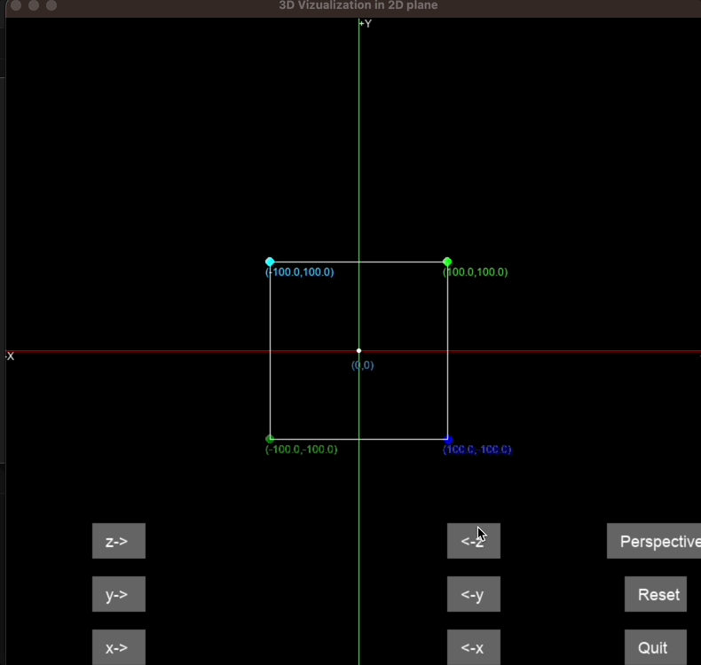
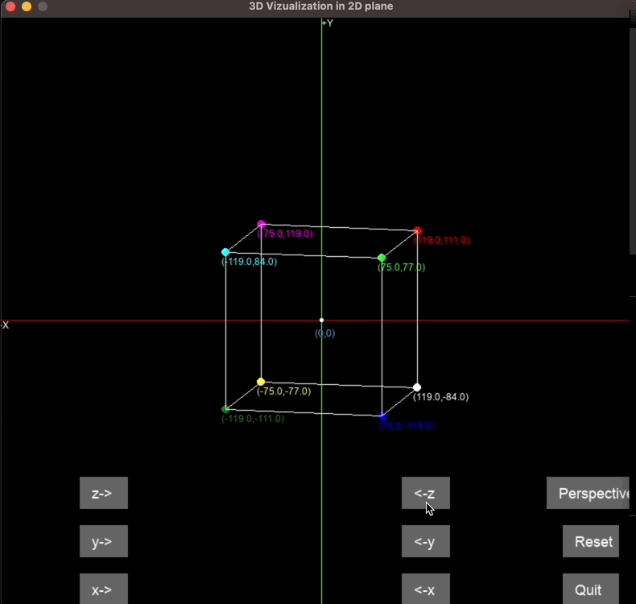

# Projection_3D_to_2D_in_Pygame

This project demonstrates the projection of 3D objects onto a 2D screen using Pygame. It allows you to visualize and interact with 3D objects in a 2D space.





## Authors
- Tushar Mahat
- Nabin Bhandari

## Description

This Python project utilizes Pygame to create a 3D visualization of objects projected onto a 2D screen. It provides options to rotate the objects along different axes and toggle perspective projection.

## Installation and Setup

1. Make sure you have Python installed on your machine. If not, download and install it from the [official Python website](https://www.python.org/downloads/).
2. Clone this repository to your local machine using Git:
   ```
   git clone https://github.com/tusharmahat/Projection_3D_to_2D_in_Pygame.git
   ```
3. Navigate to the project directory:
   ```
   cd Projection_3D_to_2D_in_Pygame
   ```
4. Install the required dependencies using pip:
   ```
   pip install pygame numpy
   ```
   This command will install the Pygame library for graphics and input handling, as well as the NumPy library for mathematical operations.

5. Run the project:
   ```
   python game.py
   ```

## Controls

- Use the mouse to interact with buttons and sliders.
- Click on the buttons to perform specific actions:
  - Quit: Close the application.
  - Reset: Reset the view to its initial state.
  - Perspective: Toggle perspective projection.
  - Rotate buttons: Rotate the object along the X, Y, and Z axes.

## Screenshots/GIFs

Include screenshots or GIFs showcasing your 3D visualization in the README.md file to provide a visual representation of the project.

## Contributing

Contributions to this project are welcome. Feel free to fork the repository, make improvements, and submit pull requests.

Feel free to customize the above README.md template with additional information, screenshots, or GIFs to enhance the presentation of your 3D visualization project.
